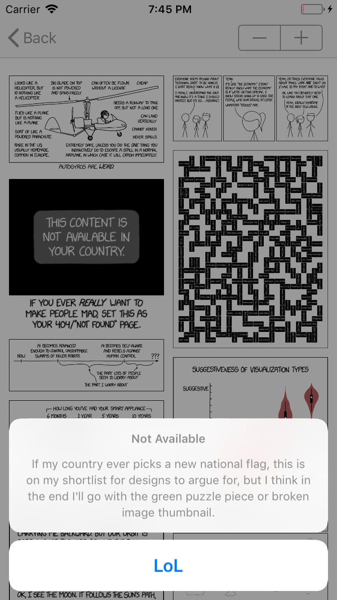

# XKCDWaterfall
App-exercise that shows XKCD comics using waterfall collection view

* Collection view has waterfall design.
* Pictures are loaded asynchronously.
* Number of columns is customisable.

Most of the sizes for images are cached in a file to prevent constant rearranging of the images during scrolling.  
XKCD do not provide image size in metadata, so the only way to get the image size is to download them.

